# Mini Job Board Application Tracker

A lightweight careers portal and applicant tracking system: candidates browse
jobs, apply, and follow their own application through the hiring pipeline;
recruiters manage the jobs and move candidates along.

**React → FastAPI → PostgreSQL**, containerised with Docker, deployed to AWS
(ECS Fargate behind an ALB, static frontend on S3 + CloudFront) with
infrastructure defined entirely in Terraform and shipped by GitHub Actions using
OIDC — no long-lived AWS keys anywhere.

| | |
|---|---|
| **GitHub repository** | `https://github.com/<your-username>/mini-job-board-application-tracker` |
| **Live application** | *(the CloudFront URL printed by `make deploy` — see [Deploying to AWS](#14-deploying-to-aws))* |
| **YouTube walkthrough** | *(to be recorded — see [Recording the walkthrough](#23-recording-the-walkthrough))* |

> The live URL and the video link are placeholders until the project is deployed
> into a real AWS account and the walkthrough is recorded. Everything else in
> this README describes code that exists and has been run.

---

## Contents

1. [Problem statement](#1-problem-statement)
2. [Objective](#2-objective)
3. [Features](#3-features)
4. [Candidate journey](#4-candidate-journey)
5. [Administrator journey](#5-administrator-journey)
6. [Architecture](#6-architecture)
7. [Repository structure](#7-repository-structure)
8. [Technology stack](#8-technology-stack)
9. [Database schema](#9-database-schema)
10. [Application statuses](#10-application-statuses)
11. [API summary](#11-api-summary)
12. [Running it locally](#12-running-it-locally)
13. [Terraform](#13-terraform)
14. [Deploying to AWS](#14-deploying-to-aws)
15. [GitHub OIDC setup](#15-github-oidc-setup)
16. [GitHub Actions](#16-github-actions)
17. [Monitoring](#17-monitoring)
18. [Security](#18-security)
19. [Testing](#19-testing)
20. [Load testing](#20-load-testing)
21. [Cost](#21-cost)
22. [Destroying everything](#22-destroying-everything)
23. [Recording the walkthrough](#23-recording-the-walkthrough)
24. [Troubleshooting](#24-troubleshooting)
25. [Screenshots](#25-screenshots)
26. [Easy AWS deployment from a Mac (step by step)](#26-easy-aws-deployment-from-a-mac-step-by-step)

---

## 1. Problem statement

A startup is hiring across engineering, sales, HR and operations. Right now:

- job openings live in a Google Doc that nobody keeps current,
- applications arrive as email attachments in one shared inbox,
- candidates email a week later asking "has anyone looked at my application?",
  and nobody can answer without searching the inbox,
- there is no single view of who is at which stage.

A full Applicant Tracking System costs more per month than the team wants to
commit to before they know their hiring volume. What they actually need is
small: a public careers page, an application form, and one screen where a
recruiter can see the pipeline.

## 2. Objective

Build that small thing properly, end to end:

> A public careers portal where candidates find and apply for roles and receive
> a tracking code they can use to check their own status, plus an authenticated
> admin console where recruiters manage jobs and move candidates through
> `APPLIED → SCREENING → INTERVIEW → SELECTED` (or `REJECTED`).

And deploy it the way a real service is deployed — containerised, on managed AWS
infrastructure, with the infrastructure in version control, the pipeline
automated, and a teardown that actually works.

This repository is **production-shaped but not production-scale**. It runs one
Fargate task in front of a single-AZ `db.t4g.micro`. It is a teaching,
demonstration and portfolio project, and it is described as such throughout.

## 3. Features

**Candidate (public, no account needed)**

- Careers page with a hero, live active-job count and department shortcuts
- Full-text search across title, description, skills and department
- Filters for department, location and employment type, plus sorting and reset
- Server-side pagination (the API never dumps the whole table)
- Job detail page: description, responsibilities, skills, experience, job code
- Application form with name, email, phone, experience, profile URL, cover note
- Optional resume upload (PDF/DOC/DOCX, 5 MB), validated on both sides
- A generated tracking code (`APP-2026-K9P4R2`) shown once on submission
- Tracking page: `code + email` returns status, job and timestamps — nothing else
- Loading, empty and error states everywhere, and a mobile layout that works

**Administrator (JWT authenticated)**

- Sign in with email and a bcrypt-hashed password
- Dashboard: active jobs, applications, interviews, selected, status breakdown,
  department breakdown, recent applications
- Create, edit, activate and deactivate jobs (deactivate, never delete, once
  applications exist)
- Application list with search by name/email/code and filters by status, job and
  date, with pagination
- Application detail: contact details, cover note, resume, internal notes
- Status changes constrained by the pipeline rules, with an optional note
  recorded against the move
- Resume access through a short-lived expiring link; the bucket stays private

## 4. Candidate journey

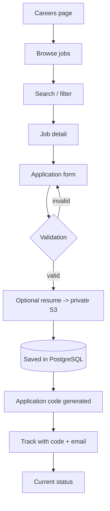
```mermaid
flowchart TD
    A[Careers page] --> B[Browse jobs]
    B --> C[Search / filter]
    C --> D[Job detail]
    D --> E[Application form]
    E --> F{Validation}
    F -- invalid --> E
    F -- valid --> G[Optional resume -> private S3]
    G --> H[(Saved in PostgreSQL)]
    H --> I[Application code generated]
    I --> J[Track with code + email]
    J --> K[Current status]
```

## 5. Administrator journey

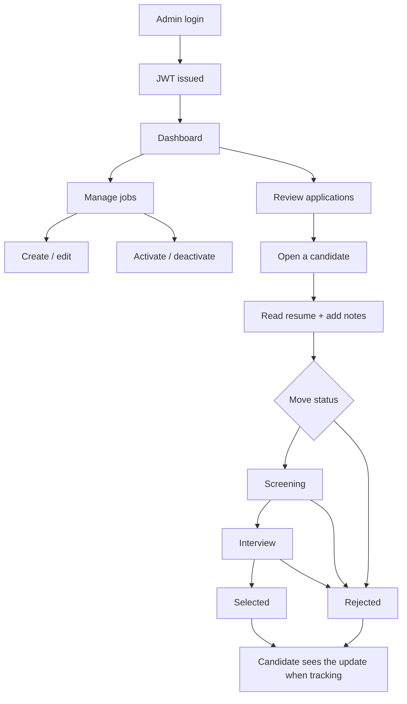
```mermaid
flowchart TD
    A[Admin login] --> B[JWT issued]
    B --> C[Dashboard]
    C --> D[Manage jobs]
    C --> E[Review applications]
    D --> D1[Create / edit]
    D --> D2[Activate / deactivate]
    E --> F[Open a candidate]
    F --> G[Read resume + add notes]
    G --> H{Move status}
    H --> I[Screening]
    I --> J[Interview]
    J --> K[Selected]
    H --> L[Rejected]
    I --> L
    J --> L
    K --> M[Candidate sees the update when tracking]
    L --> M
```

## 6. Architecture

### Deployed on AWS

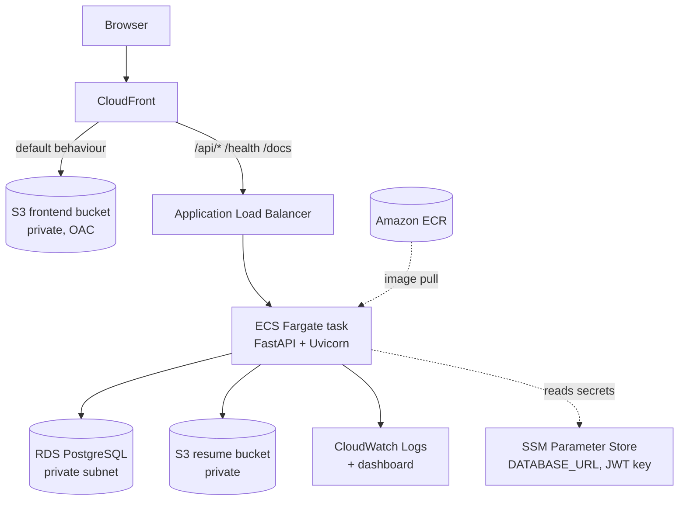
```mermaid
flowchart TD
    U[Browser] --> CF[CloudFront]

    CF -- "default behaviour" --> S3F[(S3 frontend bucket<br/>private, OAC)]
    CF -- "/api/* /health /docs" --> ALB[Application Load Balancer]

    ALB --> ECS[ECS Fargate task<br/>FastAPI + Uvicorn]
    ECS --> RDS[(RDS PostgreSQL<br/>private subnet)]
    ECS --> S3R[(S3 resume bucket<br/>private)]
    ECS --> CW[CloudWatch Logs<br/>+ dashboard]
    ECS -. reads secrets .-> SSM[SSM Parameter Store<br/>DATABASE_URL, JWT key]

    ECR[(Amazon ECR)] -. image pull .-> ECS
```

Everything the browser touches is one HTTPS origin: CloudFront serves the React
bundle from a private S3 bucket and forwards `/api/*` to the load balancer. That
removes CORS preflights in production and avoids mixed content, because the ALB
itself has no TLS certificate (there is no custom domain).

### Network and trust boundaries

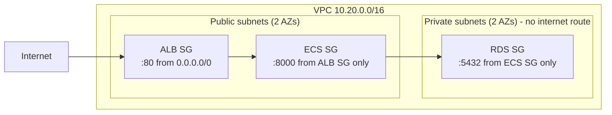
```mermaid
flowchart LR
    subgraph VPC["VPC 10.20.0.0/16"]
        subgraph Public["Public subnets (2 AZs)"]
            ALBSG["ALB SG<br/>:80 from 0.0.0.0/0"]
            ECSSG["ECS SG<br/>:8000 from ALB SG only"]
        end
        subgraph Private["Private subnets (2 AZs) - no internet route"]
            RDSSG["RDS SG<br/>:5432 from ECS SG only"]
        end
    end
    Internet --> ALBSG --> ECSSG --> RDSSG
```

Each security group references the previous one's *group id*, never a CIDR
range, so there is no way to accidentally widen the database to the internet.

**Why no NAT Gateway?** A NAT Gateway costs roughly $32/month plus data
processing — more than every other component here combined. The only thing that
needs outbound internet is the ECS task (ECR pull, S3, CloudWatch), so tasks run
in the public subnets with a public IP and an inbound rule that admits the load
balancer and nothing else. The database, which must never be internet-reachable,
sits in subnets with no internet route at all.

### Request path through the backend

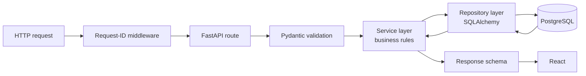
```mermaid
flowchart LR
    R[HTTP request] --> M[Request-ID middleware]
    M --> RT[FastAPI route]
    RT --> P[Pydantic validation]
    P --> SV[Service layer<br/>business rules]
    SV --> RP[Repository layer<br/>SQLAlchemy]
    RP --> DB[(PostgreSQL)]
    DB --> RP --> SV --> SC[Response schema] --> C[React]
```

The layering is enforced by convention and reviewed in `rules/project-rules.md`:
routes hold no business logic, services construct no SQL, repositories raise no
HTTP errors.

### Local development

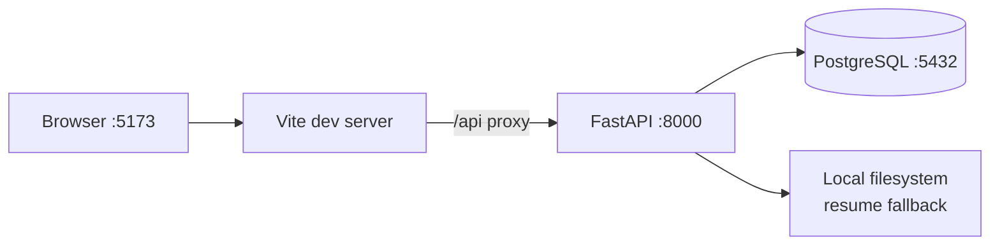
```mermaid
flowchart LR
    B[Browser :5173] --> V[Vite dev server]
    V -- "/api proxy" --> F[FastAPI :8000]
    F --> P[(PostgreSQL :5432)]
    F --> L[Local filesystem<br/>resume fallback]
```

### CI/CD

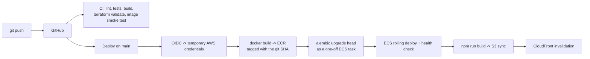
```mermaid
flowchart LR
    G[git push] --> GH[GitHub]
    GH --> CI[CI: lint, tests, build,<br/>terraform validate, image smoke test]
    GH --> D[Deploy on main]
    D --> O[OIDC -> temporary AWS credentials]
    O --> IMG[docker build -> ECR<br/>tagged with the git SHA]
    IMG --> MIG[alembic upgrade head<br/>as a one-off ECS task]
    MIG --> ECS[ECS rolling deploy + health check]
    ECS --> FE[npm run build -> S3 sync]
    FE --> INV[CloudFront invalidation]
```

## 7. Repository structure

```
mini-job-board-application-tracker/
├── backend/
│   ├── app/
│   │   ├── main.py              app factory, CORS, exception handlers
│   │   ├── api/v1/              thin route handlers, one file per area
│   │   ├── core/                config, security, logging, middleware, errors
│   │   ├── db/                  engine, session, declarative base, metadata
│   │   ├── models/              SQLAlchemy models + the enums (source of truth)
│   │   ├── schemas/             Pydantic request/response models
│   │   ├── repositories/        ALL SQLAlchemy query construction
│   │   └── services/            business rules and orchestration
│   ├── alembic/                 migrations — the only way the schema changes
│   ├── tests/                   141 pytest tests
│   ├── scripts/seed.py          idempotent demo seed
│   ├── Dockerfile               multi-stage, non-root, healthcheck
│   └── requirements.txt
│
├── frontend/
│   ├── src/
│   │   ├── api/                 the single axios instance + typed API modules
│   │   ├── auth/                context, provider, ProtectedRoute
│   │   ├── components/          common / layout / jobs / applications / admin
│   │   ├── pages/               one file per route
│   │   ├── hooks/               useAsync, useDebounce, useDocumentTitle
│   │   ├── types/api.ts         TypeScript mirror of the API contract
│   │   ├── router/routes.tsx    routes with lazy loading
│   │   └── __tests__/           48 Vitest tests
│   ├── Dockerfile               dev + nginx-serve targets
│   └── vite.config.ts
│
├── terraform/                   one file per AWS concern, flat, tagged
│   ├── main.tf  versions.tf  providers.tf  variables.tf  locals.tf  outputs.tf
│   ├── network.tf  security_groups.tf  s3.tf  cloudfront.tf  alb.tf
│   ├── ecr.tf  ecs.tf  autoscaling.tf  rds.tf  iam.tf  github_oidc.tf
│   ├── cloudwatch.tf
│   └── terraform.tfvars.example
│
├── scripts/                     bootstrap, deploy, destroy, seed, verify
├── seed/jobs.json               15-job demo catalogue
├── load-test/test.js            k6 read-heavy smoke test
├── docs/screenshots/            UI screenshots used below
├── .github/workflows/           ci.yml, deploy.yml
├── skills/…/SKILL.md            repeatable workflows for extending this repo
├── rules/project-rules.md       the short, checkable version of CLAUDE.md
├── CLAUDE.md                    how to work in this repository
├── RESTRICTIONS.md              the hard rules, and how each is enforced
├── Makefile                     every command in one place
└── docker-compose.yml           postgres + backend + frontend
```

## 8. Technology stack

| Layer | Choice | Why |
|---|---|---|
| Frontend | React 18 + TypeScript + Vite | Typed components against a typed API contract; Vite builds in ~1.5s |
| Styling | Tailwind CSS | One design system in `tailwind.config.js`, no CSS file sprawl |
| Routing | React Router 6 | Lazy-loaded routes: a candidate never downloads the admin console |
| HTTP | Axios | One instance, one base URL, one auth interceptor |
| Backend | FastAPI + Pydantic v2 | Type hints give validation, serialisation and OpenAPI for free |
| ORM | SQLAlchemy 2.x | Parameterised SQL, explicit sessions, real relationship modelling |
| Migrations | Alembic | A deployed database has data; `create_all()` cannot add a column |
| Auth | PyJWT (HS256) + bcrypt | Stateless tokens any task can verify; adaptive password hashing |
| Database | PostgreSQL 16 / RDS | Foreign keys, transactions, partial unique indexes |
| Object storage | Amazon S3 | Resumes are large, rarely read and never queried |
| Compute | ECS Fargate | Rolling deploys and health-based replacement with no EC2 to patch |
| Registry | Amazon ECR | In-account image storage with a lifecycle policy |
| Edge | CloudFront + private S3 | HTTPS, caching and one origin for the whole app |
| IaC | Terraform | The infrastructure is reviewable, repeatable and destroyable |
| CI/CD | GitHub Actions + OIDC | No stored AWS credentials to leak or rotate |
| Observability | CloudWatch Logs + dashboard | Structured JSON logs queryable with Logs Insights |

Deliberately **not** used: Kubernetes/EKS, Kafka/MSK, OpenSearch, ElastiCache,
API Gateway, Route 53, WAF, SQS/SNS. Each would add cost and moving parts
without changing what this application does. See `RESTRICTIONS.md`.

## 9. Database schema

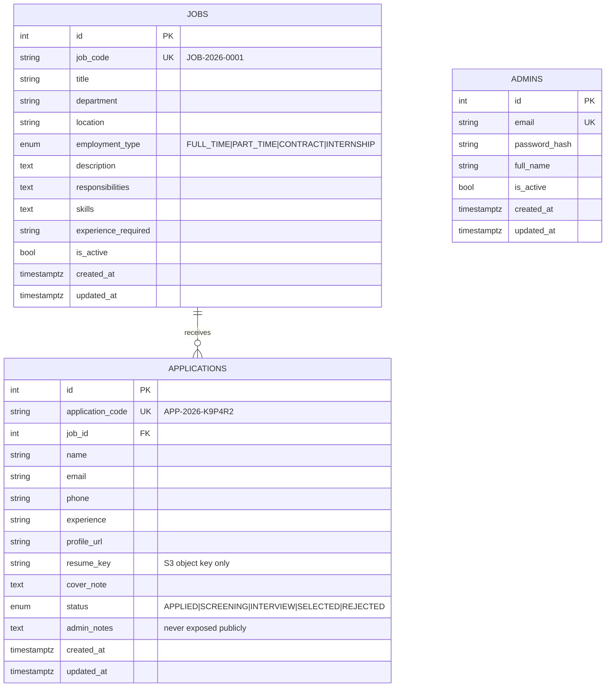
```mermaid
erDiagram
    JOBS ||--o{ APPLICATIONS : receives
    ADMINS {
        int id PK
        string email UK
        string password_hash
        string full_name
        bool is_active
        timestamptz created_at
        timestamptz updated_at
    }
    JOBS {
        int id PK
        string job_code UK "JOB-2026-0001"
        string title
        string department
        string location
        enum employment_type "FULL_TIME|PART_TIME|CONTRACT|INTERNSHIP"
        text description
        text responsibilities
        text skills
        string experience_required
        bool is_active
        timestamptz created_at
        timestamptz updated_at
    }
    APPLICATIONS {
        int id PK
        string application_code UK "APP-2026-K9P4R2"
        int job_id FK
        string name
        string email
        string phone
        string experience
        string profile_url
        string resume_key "S3 object key only"
        text cover_note
        enum status "APPLIED|SCREENING|INTERVIEW|SELECTED|REJECTED"
        text admin_notes "never exposed publicly"
        timestamptz created_at
        timestamptz updated_at
    }
```

**Indexes** (all created in `alembic/versions/0001_initial_schema.py`):

| Table | Index | Purpose |
|---|---|---|
| jobs | `ix_jobs_job_code` (unique) | Lookup by human-facing code |
| jobs | `ix_jobs_department`, `ix_jobs_location`, `ix_jobs_employment_type`, `ix_jobs_is_active` | Careers-page filters |
| jobs | `ix_jobs_active_created` | The exact careers-page query: active jobs, newest first |
| applications | `ix_applications_application_code` (unique) | Candidate tracking |
| applications | `ix_applications_job_id`, `ix_applications_email`, `ix_applications_status`, `ix_applications_created_at` | Admin filters |
| applications | `ix_applications_job_status` | "applications for job X in status Y" |
| applications | `uq_applications_job_email_active` (unique, partial) | The duplicate-application rule |
| admins | `ix_admins_email` (unique) | Login |

**The duplicate rule.** One *live* application per `(job_id, email)`:

```sql
CREATE UNIQUE INDEX uq_applications_job_email_active
  ON applications (job_id, email)
  WHERE status <> 'REJECTED';
```

The service checks first and returns a clean `DUPLICATE_APPLICATION` error; the
partial index is the backstop against two concurrent submissions racing past
that check. Rejected applications are excluded, so a candidate who was turned
down may apply again later.

## 10. Application statuses

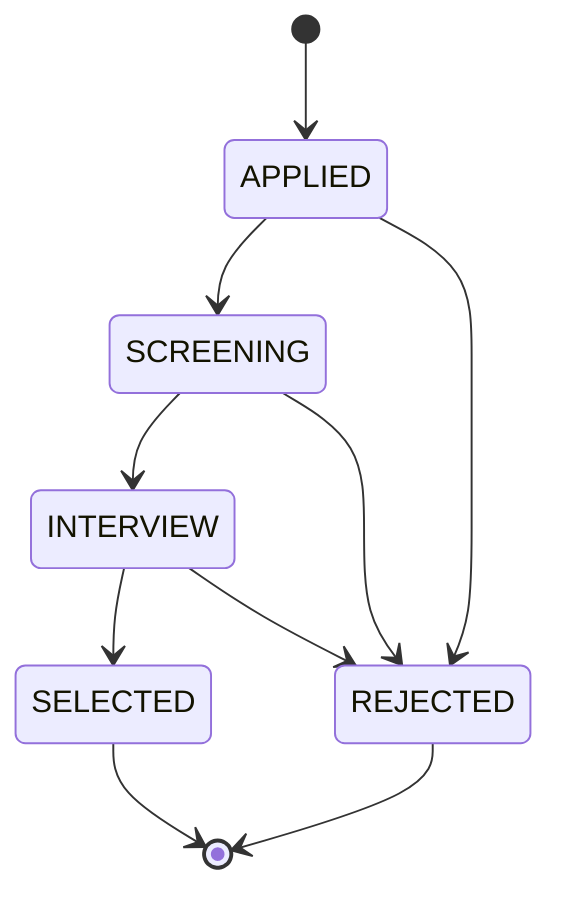
```mermaid
stateDiagram-v2
    [*] --> APPLIED
    APPLIED --> SCREENING
    SCREENING --> INTERVIEW
    INTERVIEW --> SELECTED
    APPLIED --> REJECTED
    SCREENING --> REJECTED
    INTERVIEW --> REJECTED
    SELECTED --> [*]
    REJECTED --> [*]
```

Stages cannot be skipped, the pipeline cannot run backwards, and `SELECTED` and
`REJECTED` are terminal. There is exactly one implementation of these rules —
`ApplicationStatus.can_transition` in `backend/app/models/enums.py`. The API
returns the legal next steps with every application, so the admin UI renders
only the buttons that will actually work, and an illegal request still fails
server-side with `INVALID_STATUS_TRANSITION`.

## 11. API summary

Base URL: `/api/v1`. Interactive documentation at `/docs`.

### Public

| Method | Path | Notes |
|---|---|---|
| `GET` | `/health` | Liveness. Used by the ALB target group. Does not touch the database |
| `GET` | `/health/ready` | Readiness. Checks PostgreSQL; reports resume storage as informational |
| `GET` | `/api/v1/jobs` | `search`, `department`, `location`, `employment_type`, `sort`, `page`, `page_size`. Active jobs only |
| `GET` | `/api/v1/jobs/filters` | Filter dropdown values + active-job count |
| `GET` | `/api/v1/jobs/{job_id}` | Full posting. An inactive job returns 404 |
| `POST` | `/api/v1/jobs/{job_id}/applications` | `multipart/form-data`, optional `resume`. Returns the application code |
| `GET` | `/api/v1/applications/track` | `application_code` **and** `email`, both required |

### Admin — every route requires `Authorization: Bearer <jwt>`

| Method | Path | Notes |
|---|---|---|
| `POST` | `/api/v1/admin/auth/login` | Email + password → JWT |
| `GET` | `/api/v1/admin/auth/me` | Current administrator; also the front end's token check |
| `GET` | `/api/v1/admin/jobs` | Includes inactive jobs, with application counts |
| `POST` | `/api/v1/admin/jobs` | `job_code` is generated server-side |
| `GET` | `/api/v1/admin/jobs/{id}` | Including inactive |
| `PATCH` | `/api/v1/admin/jobs/{id}` | Partial update |
| `PATCH` | `/api/v1/admin/jobs/{id}/activate` | Publish |
| `PATCH` | `/api/v1/admin/jobs/{id}/deactivate` | Close to new applicants |
| `GET` | `/api/v1/admin/applications` | `search`, `job_id`, `status`, `date_from`, `date_to`, paging |
| `GET` | `/api/v1/admin/applications/{id}` | Includes notes and the legal next statuses |
| `PATCH` | `/api/v1/admin/applications/{id}/status` | Validated against the pipeline |
| `PATCH` | `/api/v1/admin/applications/{id}/notes` | Internal notes |
| `GET` | `/api/v1/admin/applications/{id}/resume` | Short-lived expiring link |
| `GET` | `/api/v1/admin/stats` | Dashboard statistics |

### Responses

Lists are always the same envelope:

```json
{ "items": [], "page": 1, "page_size": 12, "total": 34, "pages": 3 }
```

Errors are always the same envelope:

```json
{
  "success": false,
  "error": { "code": "JOB_NOT_FOUND", "message": "The requested job was not found." },
  "request_id": "7f3c1a9b2e4d5f60"
}
```

`request_id` also comes back in the `X-Request-ID` header and appears in every
CloudWatch log line for that request, so a failure a user reports can be found
directly:

```
fields @timestamp, level, message, path, status_code
| filter request_id = "7f3c1a9b2e4d5f60"
```

Error codes: `JOB_NOT_FOUND`, `JOB_INACTIVE`, `APPLICATION_NOT_FOUND`,
`DUPLICATE_APPLICATION`, `INVALID_APPLICATION_STATUS`,
`INVALID_STATUS_TRANSITION`, `INVALID_RESUME`, `RESUME_TOO_LARGE`,
`RESUME_NOT_AVAILABLE`, `UNAUTHORIZED`, `FORBIDDEN`, `VALIDATION_ERROR`,
`DATABASE_ERROR`, `INTERNAL_ERROR`.

## 12. Running it locally

### Prerequisites

Docker Desktop. That is all for the Docker path. For the native path you also
need Python 3.11+, Node 20+ and a PostgreSQL instance.

### One command

```bash
git clone https://github.com/<your-username>/mini-job-board-application-tracker.git
cd mini-job-board-application-tracker
./scripts/bootstrap.sh
```

That copies `.env.example` to `.env`, builds the images, starts PostgreSQL, the
API and the Vite dev server, applies migrations, seeds the demo data and waits
until `/health` answers.

| | |
|---|---|
| Frontend | <http://localhost:5173> |
| API | <http://localhost:8000/api/v1/jobs> |
| Swagger | <http://localhost:8000/docs> |
| Health | <http://localhost:8000/health> |
| PostgreSQL | `localhost:5432` (`jobboard` / `jobboard_local_password`) |

Admin sign-in comes from `.env` — by default `admin@minijobboard.dev` /
`ChangeMe123!`. Change both before exposing this anywhere.

Or, equivalently:

```bash
make local        # docker compose up
make down         # stop, keep the database volume
docker compose down -v   # stop and wipe the database
```

### Native (no Docker for the app)

```bash
make install                      # backend venv + npm ci
createdb jobboard                 # or point DATABASE_URL at any PostgreSQL
cp .env.example .env              # then edit DATABASE_URL for localhost
make migrate                      # alembic upgrade head
TARGET=local make seed            # idempotent demo data

cd backend && .venv/bin/uvicorn app.main:app --reload    # :8000
cd frontend && npm run dev                                # :5173
```

### Migrations

```bash
make migrate                                  # alembic upgrade head
make makemigration m="add interview_date"     # autogenerate a revision
cd backend && .venv/bin/alembic check         # models and migrations agree?
cd backend && .venv/bin/alembic downgrade -1  # roll back one revision
```

`alembic check` also runs in CI, so "changed a model, forgot the migration"
fails the pull request rather than a production deploy.

### Seeding

```bash
make seed                       # against the running containers
TARGET=local make seed          # against the local venv
./scripts/seed.sh --no-demo     # jobs and the admin only, no fake applications
```

The seed is idempotent: jobs upsert on `job_code`, demo applications use fixed
codes `APP-2026-S001…S040`, and the bootstrap admin is created only if missing
(an existing admin's password is never reset). Run it as many times as you like.

It creates 15 jobs across 9 departments and 6 locations — one deliberately
inactive, so the admin console has something to demonstrate activation with —
and 40 clearly fictional applications distributed across the pipeline as a
believable funnel.

### Resumes locally

With `S3_RESUME_BUCKET` empty the storage service writes to
`backend/.local-storage/` instead of S3, so the whole stack runs with no AWS
account. It logs a warning each time — it never pretends the upload reached S3.
Admin resume links then use a signed, single-purpose, five-minute token in the
query string, which is the same user experience as an S3 presigned URL and is
there to make that concept concrete.

## 13. Terraform

```bash
cd terraform
cp terraform.tfvars.example terraform.tfvars   # set github_repository at least
terraform init
terraform plan      # read this before applying
terraform apply
```

Or `make infra-init`, `make infra-plan`, `make infra-apply`.

### What gets created

| File | Resources |
|---|---|
| `network.tf` | VPC, 2 public + 2 private subnets across 2 AZs, IGW, route tables |
| `security_groups.tf` | ALB → ECS → RDS chain, each referencing the previous group |
| `s3.tf` | Private frontend and resume buckets, encryption, public-access block, OAC policy, resume lifecycle rule |
| `cloudfront.tf` | One distribution, S3 + ALB origins, SPA fallback, cache behaviours |
| `alb.tf` | Load balancer, target group (`/health`), listener |
| `ecr.tf` | Repository, scan-on-push, keep-last-10 lifecycle policy |
| `ecs.tf` | Cluster, task definition (256 CPU / 512 MB), service with circuit breaker |
| `autoscaling.tf` | CPU target tracking, 1–4 tasks |
| `rds.tf` | PostgreSQL 16, `db.t4g.micro`, private, plus SSM SecureString parameters |
| `iam.tf` | ECS execution role and task role, both least-privilege |
| `github_oidc.tf` | OIDC provider and the deployment role, scoped to this repository |
| `cloudwatch.tf` | Log group, dashboard, healthy-target alarm |

State is local by design: one `apply`, one `destroy`, no bootstrap
chicken-and-egg. `versions.tf` documents the S3 backend block to switch to for a
team. `terraform.tfstate` contains the generated database password and is
git-ignored.

### Secrets

Terraform generates the database password and the JWT signing key with
`random_password` and stores both as SSM `SecureString` parameters. The ECS task
definition references the parameter ARNs; the *execution role* injects the
values at container start. The secrets therefore appear in neither the image,
the task definition, the repository, nor any log. Parameter Store's standard
tier is free, which is why it is used instead of Secrets Manager.

## 14. Deploying to AWS

A fresh account, start to finish:

```bash
# 1. Infrastructure (~15 minutes, mostly RDS and CloudFront)
cd terraform
cp terraform.tfvars.example terraform.tfvars
$EDITOR terraform.tfvars          # set github_repository
terraform init && terraform apply

# 2. Application: image, migrations, ECS release, frontend, invalidation
cd .. && make deploy

# 3. Seed the demo data once (the command is printed by make deploy)
aws ecs run-task --cluster mini-job-board-dev-cluster \
  --task-definition mini-job-board-dev-backend \
  --launch-type FARGATE \
  --network-configuration "awsvpcConfiguration={subnets=[subnet-…],securityGroups=[sg-…],assignPublicIp=ENABLED}" \
  --overrides '{"containerOverrides":[{"name":"backend","command":["python","-m","scripts.seed"]}]}'

# 4. Verify the deployment end to end
make verify
```

`make deploy` prints:

```
==========================================================
Mini Job Board Application Tracker deployment completed
==========================================================

Frontend:
https://d1234abcd5678.cloudfront.net

API:
https://d1234abcd5678.cloudfront.net/api/v1/jobs

ALB:
http://mini-job-board-dev-alb-123456789.us-east-1.elb.amazonaws.com

Swagger:
https://d1234abcd5678.cloudfront.net/docs

CloudWatch Dashboard:
mini-job-board-dev-dashboard
==========================================================
```

`make verify` exercises the real journeys against the live URL — health,
readiness, jobs, filters, search, the 401s on every admin endpoint, a real
application submission, tracking with the right and the wrong email, and the
duplicate rejection — then prints a pass/fail summary and exits non-zero on any
failure.

### Why the deploy order is what it is

1. **Build for `linux/amd64`.** The task definition pins `X86_64`. An image
   built on Apple Silicon without `--platform` starts on Fargate and dies with
   `exec format error`.
2. **Tag with the git SHA.** Every running task is traceable to one commit.
   `latest` moves too, but nothing deploys by it.
3. **Migrate before releasing.** `alembic upgrade head` runs as a one-off ECS
   task with the new image. If it fails, the workflow stops and the currently
   running version keeps serving traffic. Migrating inside application start-up
   would mean N tasks racing each other on every scale-out.
4. **Roll, then health check.** `deployment_minimum_healthy_percent = 100` means
   the new task must pass health checks before the old one drains. The circuit
   breaker rolls back automatically if it never becomes healthy.
5. **Frontend last**, with `index.html` uploaded `no-cache` and hashed assets
   `immutable` for a year, followed by an invalidation. In the other order,
   browsers would fetch a new `index.html` referencing assets that are not
   uploaded yet.

## 15. GitHub OIDC setup

A stored `AWS_SECRET_ACCESS_KEY` never expires, is readable by any workflow in
the repository, and has to be rotated by hand. With OIDC, GitHub presents a
signed token proving "this run is for repo X on branch main", AWS exchanges it
for credentials that expire in an hour, and there is no secret to leak.

Terraform creates the provider and the role. Trust is narrowed to this exact
repository and to `refs/heads/main` and tags — a pull request from a fork
**cannot** assume it.

After `terraform apply`, publish the outputs as repository *variables* (they are
not confidential, and visible values are far easier to debug):

```bash
cd terraform
gh variable set AWS_REGION                 --body "$(terraform output -raw aws_region)"
gh variable set AWS_DEPLOY_ROLE_ARN        --body "$(terraform output -raw github_actions_role_arn)"
gh variable set ECR_REPOSITORY             --body "$(terraform output -raw ecr_repository_url)"
gh variable set ECS_CLUSTER                --body "$(terraform output -raw ecs_cluster_name)"
gh variable set ECS_SERVICE                --body "$(terraform output -raw ecs_service_name)"
gh variable set ECS_TASK_FAMILY            --body "$(terraform output -raw ecs_task_definition_family)"
gh variable set FRONTEND_BUCKET            --body "$(terraform output -raw frontend_bucket_name)"
gh variable set CLOUDFRONT_DISTRIBUTION_ID --body "$(terraform output -raw cloudfront_distribution_id)"
gh variable set APPLICATION_URL            --body "$(terraform output -raw application_url)"
gh variable set ECS_SECURITY_GROUP_ID      --body "$(terraform output -raw ecs_task_security_group_id)"
gh variable set ECS_SUBNET_IDS             --body "$(terraform output -json ecs_task_subnet_ids | jq -r 'join(",")')"
```

If the AWS account already has a GitHub OIDC provider from another project,
import it instead of creating a second one:

```bash
terraform import aws_iam_openid_connect_provider.github \
  arn:aws:iam::<account-id>:oidc-provider/token.actions.githubusercontent.com
```

## 16. GitHub Actions

### `ci.yml` — pull requests and pushes to main

| Job | Does |
|---|---|
| `backend` | `ruff check`, `pytest --cov`, and `alembic upgrade head && alembic check` |
| `frontend` | `npm ci`, eslint, `tsc --noEmit`, vitest, `npm run build` |
| `terraform` | `fmt -check -recursive`, `init -backend=false`, `validate` |
| `docker` | Builds the backend image and smoke-tests that it serves `/health` |
| `security` | Fails if an AWS key, `.env`, `.tfstate` or `.tfvars` is tracked by git |

CI never touches AWS. It needs no credentials, and the OIDC trust policy would
refuse it anyway.

### `deploy.yml` — push to main, or manual

`test` → `backend` (OIDC → build → ECR → new task definition → migrate → ECS →
health check) → `frontend` (build → S3 → invalidation) → `summary`, which writes
the URLs and the deployed image digest into the GitHub run summary.

`concurrency: deploy-production` with `cancel-in-progress: false` means two
merges cannot race each other onto the same ECS service.

## 17. Monitoring

**Logs.** The backend emits one JSON line per request with `timestamp`, `level`,
`request_id`, `method`, `path`, `status_code` and `duration_ms`. The awslogs
driver ships them to `/ecs/mini-job-board-dev`, where Logs Insights can query
the fields directly:

```
fields @timestamp, request_id, method, path, status_code, duration_ms
| filter status_code >= 500
| sort @timestamp desc
| limit 50
```

Health-check requests are logged at `DEBUG` so the ALB's polling does not bury
real traffic. Passwords, tokens, `Authorization` headers, request bodies and
resume content are never logged.

**Dashboard** (`mini-job-board-dev-dashboard`):

| Widget | Metrics |
|---|---|
| ALB traffic | `RequestCount`, `HTTPCode_Target_4XX_Count`, `HTTPCode_Target_5XX_Count`, `HTTPCode_ELB_5XX_Count` |
| ALB health | `TargetResponseTime` p95, `HealthyHostCount`, `UnHealthyHostCount` |
| ECS | `CPUUtilization`, `MemoryUtilization` |
| RDS | `CPUUtilization`, `DatabaseConnections`, `FreeStorageSpace` |
| Errors | Live Logs Insights table of `level = ERROR` or `status_code >= 500` |

**Alarm.** One: `HealthyHostCount < 1` for three minutes — the ALB has no
healthy backend, i.e. the API is down. There is no SNS topic, because an alarm
notifying nobody is theatre; it is visible in the console and on the dashboard.

`make logs` tails locally; `aws logs tail /ecs/mini-job-board-dev --follow`
tails the deployment.

## 18. Security

| Concern | Control |
|---|---|
| Admin passwords | bcrypt with a per-password salt; there is no column that could hold plaintext |
| Sessions | HS256 JWT with `sub`/`iat`/`exp`, 60-minute expiry, signed with a Terraform-generated key |
| Revocation | The admin row is re-read on every request, so deactivating an account takes effect immediately, not at token expiry |
| Login enumeration | Unknown account, wrong password and deactivated account all return the same 401 |
| Admin API | One `get_current_admin` dependency gates every admin route. Hiding pages in React is a usability measure, not the control |
| Input validation | Pydantic on every field, strict enums, re-validated server-side even when the browser already checked |
| SQL injection | SQLAlchemy binds every parameter; a search for `' OR 1=1--` matches literally and returns nothing (there is a test) |
| File upload | Extension **and** MIME type checked, 5 MB cap enforced on bytes actually read, generated filename, so `../../etc/passwd.pdf` becomes `resumes/APP-…/resume.pdf` (there is a test) |
| Candidate data | Tracking needs code **and** email; the response contains six fields and never `admin_notes`, database ids or another candidate's data |
| Enumeration | A wrong email and an unknown code return an identical 404 |
| Resume access | Private bucket, short-lived presigned URL, never a public object |
| CORS | Restricted to the CloudFront origin plus configured local origins. Never `*` |
| Secrets | Generated by Terraform, stored in SSM SecureString, injected by the execution role. Never in git, the image or a log |
| Insecure defaults | The app refuses to start outside `ENVIRONMENT=local` with the development JWT key or a `*` CORS origin |
| Database exposure | Private subnets, `publicly_accessible = false`, security group admits only the ECS security group |
| S3 exposure | Public Access Block fully on, ACLs disabled, TLS-only bucket policy on resumes |
| IAM | The task role can only `PutObject`/`GetObject` under `resumes/*` of one bucket |
| CI credentials | OIDC only; the `security` job fails the build on a committed key, `.env`, `.tfvars` or `.tfstate` |
| Error responses | One envelope; no stack traces, SQL or credentials reach a client (there are tests asserting this) |

Run `make lint && make test` and read `RESTRICTIONS.md` for the full list and how
each item is enforced.

## 19. Testing

```bash
make test            # backend + frontend
make test-backend    # pytest
make test-frontend   # vitest
make lint            # ruff + eslint + tsc
```

**Backend — 141 tests**, running against a throwaway SQLite database so the
suite needs no services and finishes in about 35 seconds. This is only safe
because the models deliberately avoid PostgreSQL-specific types; the same ORM
code runs unchanged against RDS.

| File | Covers |
|---|---|
| `test_health.py` | Liveness, readiness, OpenAPI document, request-id header |
| `test_jobs_public.py` | Listing, envelope, pagination, search by title and skills, each filter, combined filters, sorting, rejected enum values, detail, inactive job hidden, filter options, summary truncation |
| `test_applications.py` | Submission, code format and uniqueness, persistence, email lower-casing, invalid email/phone/URL, missing fields, unknown job, inactive job, duplicates (including case-insensitive), same email on another job, re-applying after rejection, resume upload, generated key/path traversal, `.exe` rejection, MIME mismatch, oversize, empty file, no orphan row on invalid resume, tracking, case-insensitive tracking, wrong email, unknown code, missing parameter |
| `test_status_transitions.py` | Every legal transition, nine illegal ones, terminal states, table completeness |
| `test_admin_auth.py` | Login, case-insensitive email, wrong password, unknown account, deactivated account, hash format, every protected route anonymous and with a garbage token, expired token, forged signature, immediate revocation, profile without the hash |
| `test_admin_jobs.py` | Inactive jobs listed, active filter, application counts, create, unique codes, client-supplied code ignored, validation, auth required, partial update, unknown job, activate/deactivate and public visibility |
| `test_admin_applications.py` | Listing, auth, search by name/email/code, status/job/date filters, detail with legal next steps, unknown id, full pipeline walk, stage skipping, backwards moves, terminal moves, unknown status, note appending, candidate visibility of a status change, notes replacement, notes never public, resume link and expiry, auth on the link, missing resume, token bound to one application |
| `test_dashboard.py` | Auth, headline tiles, zero-filled statuses, department breakdown, recency ordering, empty system, active count after deactivation |
| `test_error_handling.py` | Envelope shape, request-id correlation, upstream id honoured, unknown route, field-level validation errors, five leakage assertions, SQL injection, 405 |

**Frontend — 48 tests** with Vitest and Testing Library:

| File | Covers |
|---|---|
| `JobsPage.test.tsx` | Renders API jobs, loading, empty, error with retry and request id, department filter, debounced search, filters read from the URL, card links |
| `JobDetailPage.test.tsx` | Full posting, responsibilities as a list, skills as tags, apply link, closed-role message, retryable error |
| `ApplicationForm.test.tsx` | Empty-form errors, malformed email, non-http URL, disallowed resume type, successful submission, server-side field errors rendered inline, duplicate message, button disabled while in flight |
| `TrackApplication.test.tsx` | Both fields required, successful lookup with pipeline, code pre-filled from the URL, failed lookup wording, rejection hides the progress bar |
| `AdminLogin.test.tsx` | Credentials submitted, server error shown, password masked, signed-in redirect |
| `AdminDashboard.test.tsx` | Four tiles, breakdowns, recent applications, loading, error |
| `AdminApplications.test.tsx` | Rows rendered, loading, status filter, filter from the URL, empty state, row links |
| `AdminApplicationDetail.test.tsx` | Candidate details, only legal transitions offered, moving a stage updates the options, illegal transition surfaced, terminal state message, notes saved, resume link requested before opening |

**Verified against real PostgreSQL.** The suites run on SQLite for speed, so the
whole stack was also exercised against PostgreSQL 16 in Docker: seeding and
re-seeding, every filter, the partial unique index rejecting a duplicate, resume
upload and download, JWT login, the full `APPLIED → SELECTED` walk, the illegal
transition from a terminal state, and the candidate seeing the updated status.
`make verify` runs the equivalent against a deployed environment.

## 20. Load testing

```bash
k6 run load-test/test.js                                   # smoke, local
k6 run -e BASE_URL=https://dxxxx.cloudfront.net load-test/test.js
k6 run -e PROFILE=load -e BASE_URL=https://dxxxx.cloudfront.net load-test/test.js
```

Three gentle profiles (`smoke` 3 VUs, `load` 10–20 VUs, `soak` 10 VUs for 15
minutes). Only safe, idempotent `GET` endpoints are exercised — job listing with
randomised filters, job detail, filter options, and a check that
`/admin/stats` still returns 401 under load. Application submissions are
excluded on purpose: they write rows, consume the one-live-application slot per
candidate, and filling a demo database with junk ruins the admin console for the
next person who demonstrates it.

Thresholds: p95 under 1500 ms, failures under 2%.

> **This development infrastructure is not intended for destructive stress
> testing.** The target is one Fargate task on 0.25 vCPU in front of a
> single-AZ `db.t4g.micro`. The architecture is stateless and would scale
> horizontally, but this deployment is small, and the numbers k6 prints describe
> *this environment* — they are not a capacity claim, and nobody should read
> them as "millions of requests".

## 21. Cost

Rough `us-east-1` idle figures, on-demand, no free tier:

| Resource | Configuration | ≈ USD/month |
|---|---|---|
| RDS PostgreSQL | `db.t4g.micro`, single-AZ, 20 GB gp3 | ~13 |
| ECS Fargate | 1 task, 0.25 vCPU / 0.5 GB, always on | ~9 |
| Application Load Balancer | 1 ALB, minimal LCU | ~17 |
| CloudFront | `PriceClass_100`, demo traffic | <1 |
| S3 | Two small buckets | <1 |
| ECR | ≤10 images, lifecycle policy | <1 |
| CloudWatch | 7-day retention, one dashboard | ~1 |
| SSM Parameter Store | Standard tier | 0 |
| **Total** | | **≈ $40–45/month** |

Costs avoided by design: no NAT Gateway (~$32), no Multi-AZ RDS (~+$13), no WAF
(~$6 + requests), no Route 53 (~$0.50 + domain), no Container Insights, no
Performance Insights, no EKS control plane (~$73).

> **Leaving this running costs real money.** Run `make destroy` when you are
> finished. The ALB and RDS bill by the hour whether or not anyone visits.

Levers in `terraform.tfvars`: `ecs_desired_count`, `ecs_task_cpu`,
`ecs_task_memory`, `db_instance_class`, `log_retention_days`,
`cloudfront_price_class`.

## 22. Destroying everything

```bash
make destroy          # or ./scripts/destroy.sh — about 10–20 minutes
make destroy-check    # optional: re-run the read-only leftover check later
```

The script lists exactly what will be destroyed, requires you to type `yes`,
and then:

1. **Stops one-off ECS tasks.** A migration or seed task that is still running
   would stop the cluster from being deleted.
2. **Empties the two project buckets.** Their names come from `terraform output`,
   so no other bucket can be touched.
3. **Runs `terraform destroy`**, retrying once if AWS eventual consistency trips
   it (typically a Fargate network interface that is still detaching).
4. **Deregisters the task definition revisions** that each deploy registered
   outside Terraform.
5. **Verifies** that the Terraform state is empty, then runs
   `scripts/check-leftovers.sh`. That script is a **read-only** scan of the
   account for anything tagged `Project=MiniJobBoardApplicationTracker` or
   named `mini-job-board-dev*`, including things AWS creates without our tags
   (log groups, RDS snapshots, retained backups).

It reports "nothing left" only when both checks pass. Otherwise it exits
non-zero and lists what remains.

| Would survive or block a naive destroy | How this project handles it |
|---|---|
| Objects in the S3 buckets | `force_destroy = true`, and the script empties them first |
| Images in ECR | `force_delete = true` |
| RDS final snapshot | `skip_final_snapshot = true` |
| RDS automated backups | `delete_automated_backups = true` |
| Deletion protection | Off on RDS and the ALB; nothing carries `prevent_destroy` |
| RDS log-export log group (created by RDS, not Terraform) | Declared in `rds.tf`, so Terraform owns it and deletes it |
| A still-running one-off ECS task | Stopped before `terraform destroy` |

There is no wildcard delete, no tag-based *delete* sweep across the account, and
no `aws s3 rb` on anything the script did not create.

**Demo-day checklist**

- **Keep `terraform/terraform.tfstate` until the destroy has finished.** It is
  the only record of what to delete. If it is ever lost, `make destroy-check`
  still lists what exists, and you delete those resources in the console.
- Run `make destroy` from the same machine and AWS profile you used for
  `make infra-apply`.
- After the destroy, a push to `main` makes the Deploy workflow fail at the OIDC
  step, because its IAM role is gone. That is harmless (the workflow cannot
  create anything), but you can silence it with `gh workflow disable Deploy`.
- If you *imported* an existing GitHub OIDC provider (see
  `terraform/github_oidc.tf`), run
  `terraform state rm aws_iam_openid_connect_provider.github` before destroying,
  so that other projects keep theirs.
- Left in place on purpose, and free: the account-wide service-linked roles AWS
  creates on first use (`AWSServiceRoleForECS`, `AWSServiceRoleForRDS`,
  `AWSServiceRoleForElasticLoadBalancing`, …).

Afterwards, only local artefacts remain: `terraform.tfstate.backup`, and the
Docker images and volumes (`docker compose down -v`).

## 23. Recording the walkthrough

The demonstration video should cover, in order:

1. Problem statement and objective (§1–2)
2. Architecture diagrams (§6), then `React → FastAPI → PostgreSQL` in the code
3. Repository structure (§7) and the layering rule
4. Frontend: `JobCard`, `JobFilters`, `ApplicationForm`, `StatusSelector`
5. Backend: a route, its service, its repository — and why they are separate
6. `models/job.py`, `models/application.py`, `models/enums.py`
7. Live candidate flow: browse → filter → apply → resume → application code
8. Tracking with the code and email
9. Admin flow: login → dashboard → create a job → review → Screening →
   Interview → Selected, then an illegal transition being rejected
10. Candidate tracking again, showing the updated status
11. Terraform files, `terraform plan`, and the AWS console showing the resources
12. GitHub Actions: a CI run and a deploy run
13. CloudWatch dashboard and a Logs Insights query by `request_id`
14. One real error hit while building, its root cause, and the fix
15. What was AI-generated versus hand-debugged

Two real errors from building this, worth using for item 14:

- **`pydantic_settings.exceptions.SettingsError: error parsing value for field
  "cors_origins"`** — the backend container crash-looped on first start.
  *Root cause:* pydantic-settings JSON-decodes any complex-typed field (here
  `list[str]`) straight from the environment, before validators run, so
  `CORS_ORIGINS=http://a,http://b` was never valid JSON and the `mode="before"`
  validator meant to split it never got the chance to run.
  *Fix:* hold the setting as a comma-separated `str` and expose the parsed list
  through the `cors_origin_list` property (`backend/app/core/config.py`).

- **The frontend loaded but every API call 500'd through the Vite proxy.**
  *Root cause:* `vite.config.ts` proxied to `http://localhost:8000`, which
  inside the frontend *container* means that container's own localhost, not the
  backend service.
  *Fix:* `VITE_PROXY_TARGET: http://backend:8000` in `docker-compose.yml`, with
  the proxy target read from the environment so the host and the container both
  work.

## 24. Troubleshooting

<details>
<summary><b>Local: the backend container restarts in a loop</b></summary>

```bash
docker compose logs backend --tail=50
```

Usually a bad `DATABASE_URL` in `.env`, or PostgreSQL not healthy yet. The
compose healthcheck should prevent the second case; `docker compose down -v &&
docker compose up --build` resolves a corrupted volume.
</details>

<details>
<summary><b>Local: the frontend loads but API calls fail</b></summary>

Check `VITE_PROXY_TARGET`. In Docker the backend is `http://backend:8000`, not
`http://localhost:8000` — see §23. Confirm the API directly with
`curl localhost:8000/health`.
</details>

<details>
<summary><b>ECS tasks start and immediately stop</b></summary>

```bash
aws ecs describe-services --cluster mini-job-board-dev-cluster --services mini-job-board-dev-backend \
  --query 'services[0].events[:5]'
aws ecs describe-tasks --cluster mini-job-board-dev-cluster --tasks <task-arn> \
  --query 'tasks[0].stoppedReason'
aws logs tail /ecs/mini-job-board-dev --since 15m
```

In order of likelihood: the image was built for arm64 (`exec format error` —
rebuild with `--platform linux/amd64`); migrations were never run so a table is
missing; the RDS security group does not admit the ECS security group; the
`DATABASE_URL` SSM parameter is wrong.
</details>

<details>
<summary><b>ALB targets are unhealthy</b></summary>

```bash
aws elbv2 describe-target-health --target-group-arn <arn>
```

The health check must hit `/health` on port 8000 and expect `200`. `/health` is
deliberately independent of the database, so an unhealthy target means the
process is not serving, not that PostgreSQL is unhappy — check
`/health/ready` for that.
</details>

<details>
<summary><b>CloudFront returns the old frontend</b></summary>

The invalidation is asynchronous; give it a minute. `index.html` is uploaded
`no-cache` and hashed assets `immutable`, so a stale page usually means the
invalidation did not run:
`aws cloudfront create-invalidation --distribution-id <id> --paths '/*'`.
</details>

<details>
<summary><b>A refresh on /jobs/12 returns 404</b></summary>

That is the SPA fallback. `cloudfront.tf` maps both 403 and 404 to
`/index.html` with a `200`. If it regresses, check those `custom_error_response`
blocks.
</details>

<details>
<summary><b>GitHub Actions: "Not authorized to perform sts:AssumeRoleWithWebIdentity"</b></summary>

`github_repository` in `terraform.tfvars` must match `owner/repo` exactly, the
trust policy only accepts `refs/heads/main` and tags (pull requests cannot
deploy — by design), and `vars.AWS_DEPLOY_ROLE_ARN` must be set. The workflow
also needs `permissions: id-token: write`, which it has.
</details>

<details>
<summary><b>terraform destroy fails on a bucket</b></summary>

Use `make destroy`, which empties the project buckets first. Terraform cannot
delete a bucket that still contains objects or delete markers.
</details>

<details>
<summary><b>make destroy-check still lists something</b></summary>

Straight after a destroy, AWS can keep listing a deleted load balancer,
CloudFront distribution or RDS instance for a few minutes. Wait ten minutes and
run `make destroy-check` again. If an item is still listed, run `make destroy`
again, which is safe to repeat. If the Terraform state is already empty, delete
that one item in the console; the check prints its exact name or ARN.
</details>

<details>
<summary><b>"Unsafe configuration: JWT_SECRET_KEY must be a strong value"</b></summary>

Working as intended. Outside `ENVIRONMENT=local` the app refuses to start with
the development signing key or a `*` CORS origin. Terraform generates a real key
into SSM; this error means the task is not reading it.
</details>

## 25. Screenshots

| | |
|---|---|
| **Careers home** | 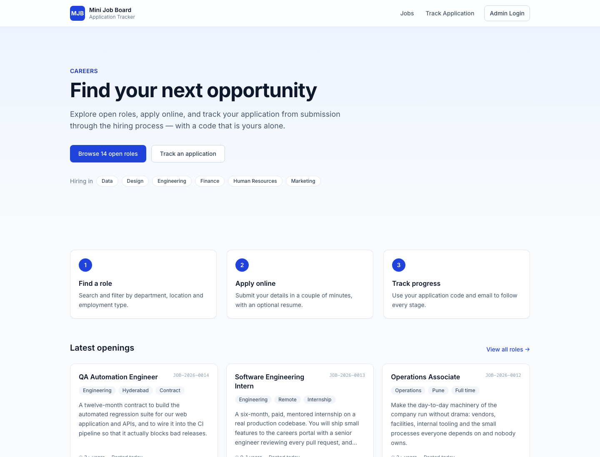 |
| **Open roles with filters** | 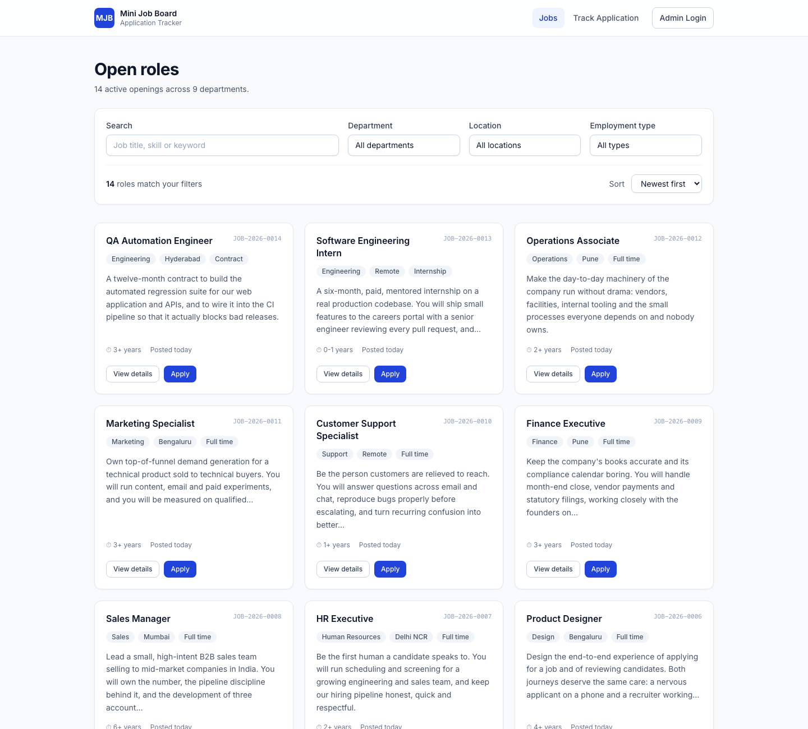 |
| **Job detail** | 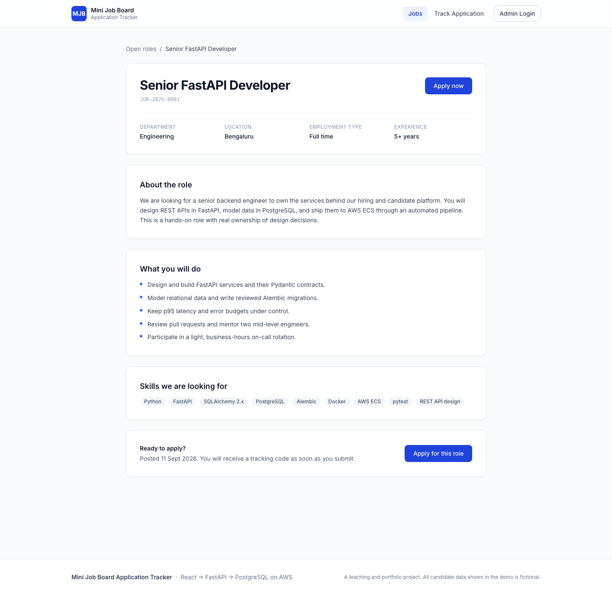 |
| **Application form** | 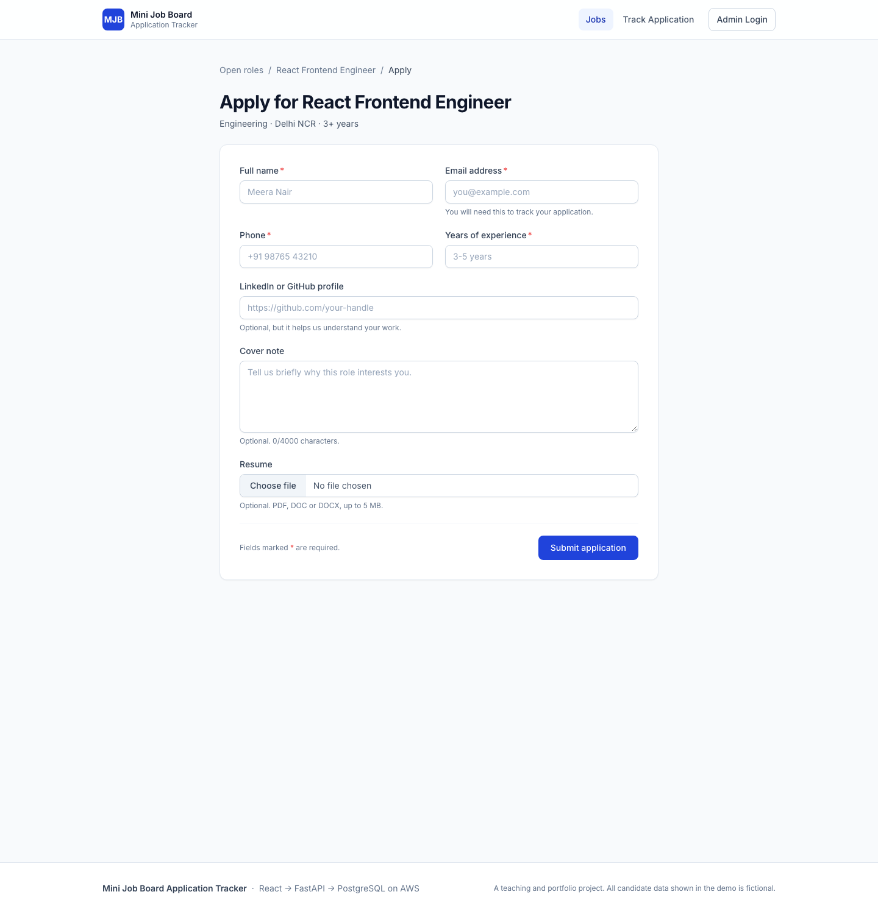 |
| **Track an application** | 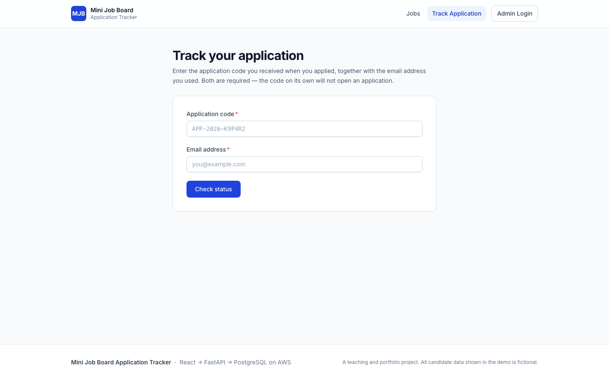 |
| **Admin sign in** | 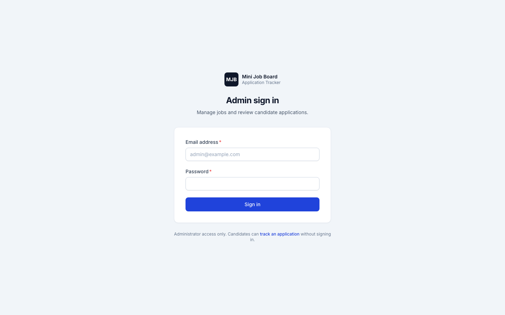 |
| **Admin dashboard** | 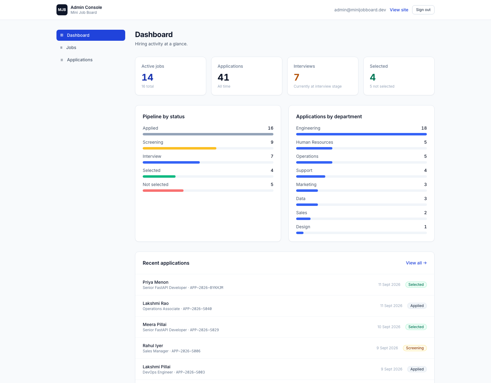 |
| **Admin jobs** | 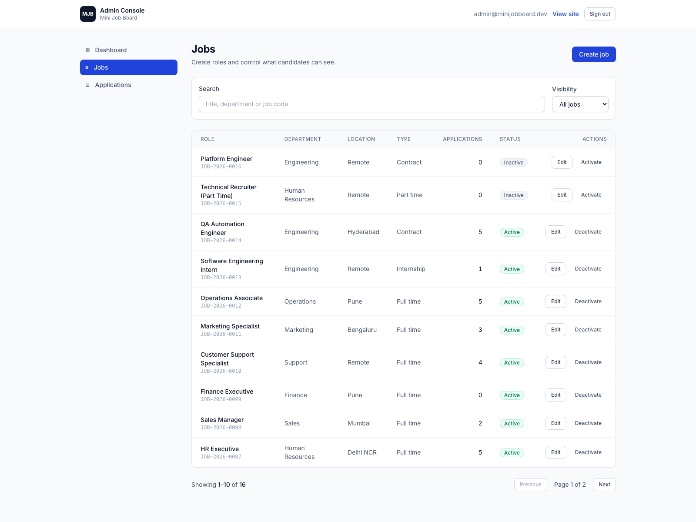 |
| **Admin applications** | 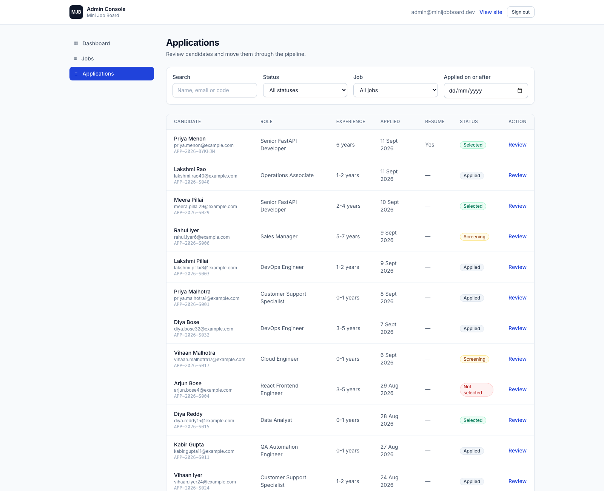 |
| **Candidate review** | 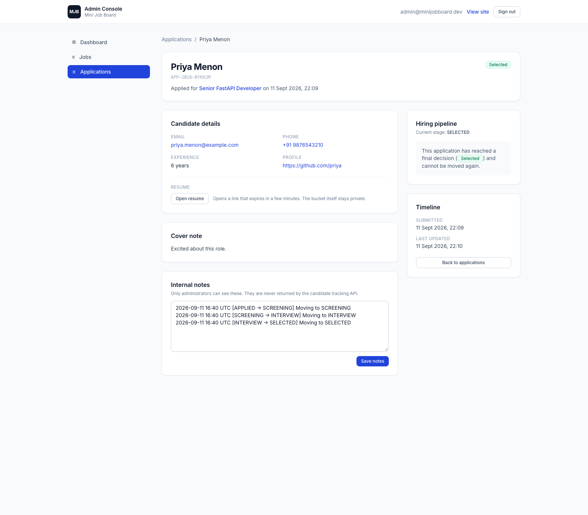 |
| **Create a job** | 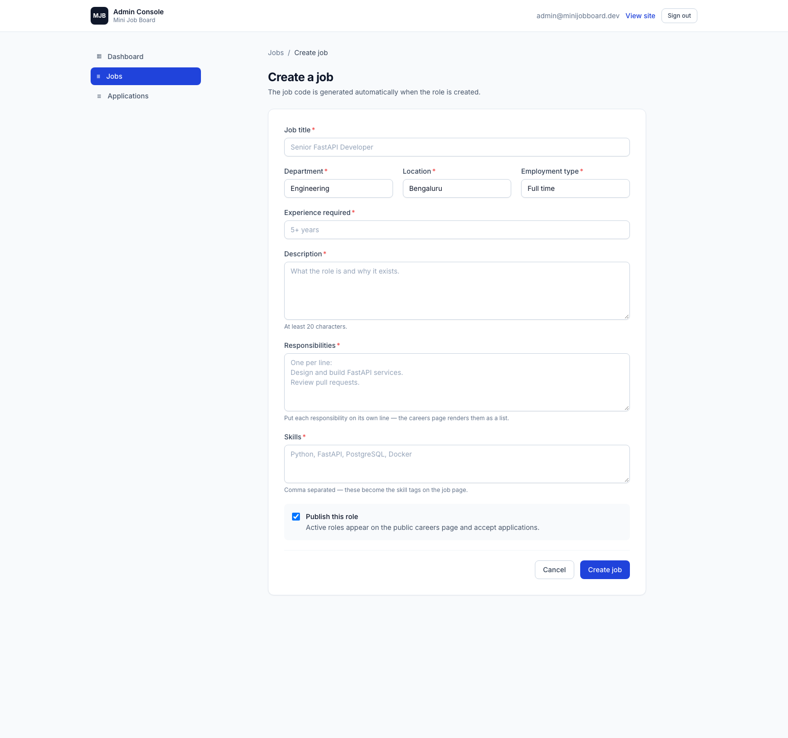 |
| **Mobile** | 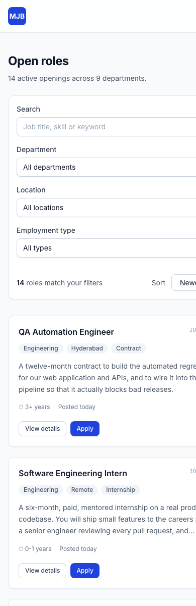 |

---

## Further reading in this repository

| File | What it is for |
|---|---|
| `CLAUDE.md` | How to work in this repository: architecture, rules per layer, deployment and teardown |
| `RESTRICTIONS.md` | The 40 hard rules, and a table of how each one is enforced in code |
| `rules/project-rules.md` | The ten checkable rules — the short version of `CLAUDE.md` |
| `skills/mini-job-board-application-tracker/SKILL.md` | Step-by-step workflows for adding a backend feature, a frontend feature, a Terraform resource, deploying, destroying, and debugging a failing ECS task |

## Licence

Released for educational use. All candidate data in the seed and the screenshots
is fictional.

---

## 26. Easy AWS deployment from a Mac (step by step)

A beginner-friendly walkthrough of [section 14](#14-deploying-to-aws) for a
one-day classroom demo: deploy, show it, and destroy it the same day. Every
command runs from the repository root in the macOS Terminal (or the VS Code
terminal).

> **Cost:** about **$1.5 per day** while it is running (≈ $40–45/month), mostly
> the load balancer and the database, billed whether or not anyone visits.
> Deploy on demo day and run [Step 7](#step-7--destroy-right-after-the-demo)
> the same day.

### Step 0 — Install the tools (one time)

```bash
brew install terraform awscli jq node git
brew install --cask docker        # then open Docker Desktop and wait until it is running
```

Check that everything is there:

```bash
docker info >/dev/null && echo "docker running"
terraform -version && aws --version && node --version && jq --version
```

### Step 1 — Connect the Mac to AWS (one time)

1. In the AWS Console, open **IAM → Users → Create user** (for example
   `demo-deployer`) and attach the **AdministratorAccess** policy. Do not use the
   root account.
2. Open that user, then **Security credentials → Create access key → Command Line
   Interface (CLI)**, and copy both keys.
3. Configure the CLI:

   ```bash
   aws configure
   # AWS Access Key ID:     <paste>
   # AWS Secret Access Key: <paste>
   # Default region name:   us-east-1
   # Default output format: json

   aws sts get-caller-identity       # must print your account id
   ```

**Recommended:** in **Billing → Budgets**, create a free $10 monthly budget with
an email alert, so a forgotten environment cannot surprise you.

### Step 2 — Set the Terraform variables

```bash
cp terraform/terraform.tfvars.example terraform/terraform.tfvars
```

Open `terraform/terraform.tfvars` and set
`github_repository = "<your-github-username>/mini-job-board-application-tracker"`.
It only matters for GitHub Actions deployments. Leave every other value alone;
the defaults are already the cheapest settings.

### Step 3 — Create the infrastructure (~15 minutes)

```bash
make infra-init
make infra-plan       # read the list of what will be created
make infra-apply      # type "yes" — billing starts here
```

If it fails with `EntityAlreadyExists … oidc-provider`, the account already has
a GitHub OIDC provider. Import it with the `terraform import` command in the
comment at the top of `terraform/github_oidc.tf`, then run `make infra-apply`
again.

### Step 4 — Deploy the application (~10 minutes)

```bash
make deploy
```

This builds the backend image for `linux/amd64` (slow the first time on Apple
Silicon) and pushes it to ECR. It then runs the database migrations, releases
the API on ECS, and uploads the React build to S3/CloudFront. At the end it
prints the **Frontend URL** (`https://xxxx.cloudfront.net`).

A warning that the image is tagged `…-dirty` only means the working tree has
uncommitted changes. It is harmless.

### Step 5 — Load the demo data and create the admin login

> ⚠️ **Always set `ADMIN_PASSWORD` here.** Without it, the bootstrap admin gets
> the demo default `ChangeMe123!` on a public URL.

```bash
CLUSTER=$(terraform -chdir=terraform output -raw ecs_cluster_name)
FAMILY=$(terraform -chdir=terraform output -raw ecs_task_definition_family)
SUBNETS=$(terraform -chdir=terraform output -json ecs_task_subnet_ids | jq -r 'join(",")')
SG=$(terraform -chdir=terraform output -raw ecs_task_security_group_id)

aws ecs run-task --cluster "$CLUSTER" --task-definition "$FAMILY" --launch-type FARGATE \
  --network-configuration "awsvpcConfiguration={subnets=[$SUBNETS],securityGroups=[$SG],assignPublicIp=ENABLED}" \
  --overrides '{"containerOverrides":[{"name":"backend","command":["python","-m","scripts.seed"],"environment":[{"name":"ADMIN_EMAIL","value":"you@example.com"},{"name":"ADMIN_PASSWORD","value":"CHOOSE-A-STRONG-PASSWORD"}]}]}'
```

Replace the email and password first. The seed is idempotent: re-running it
never duplicates data and never resets an existing admin's password. After about
a minute, confirm it worked:

```bash
aws logs tail /ecs/mini-job-board-dev --since 5m | grep -E "admin|jobs"
# expect a line like: admin: created (you@example.com)
```

### Step 6 — Verify, then run the demo

```bash
make verify     # health, jobs, 401s on admin routes, apply + track — all must pass
```

Open the Frontend URL:

- **Candidate:** browse jobs, search and filter, apply (optionally with a
  resume), then track the application with its code and email.
- **Administrator:** open `/admin/login` and sign in with the email and password
  from Step 5. Check the stats, open an application, add a note, and move it
  through the pipeline.

If the page does not load immediately, give CloudFront a few minutes. To
redeploy after a code change, just run `make deploy` again.

### Step 7 — Destroy right after the demo

```bash
make destroy          # type "yes" — about 10–20 minutes
make destroy-check    # run again ~10 minutes later; it must report nothing remains
```

See [section 22](#22-destroying-everything) for what the destroy covers.

> **Keep `terraform/terraform.tfstate` until the destroy has finished.** It is the
> record of what to delete. Run the destroy from the same Mac and AWS profile
> that created the environment.

### Quick reference

| When | Command |
|---|---|
| Once per Mac | `brew install …`, `aws configure` |
| Before the demo | `make infra-init && make infra-apply` → `make deploy` → seed (Step 5) → `make verify` |
| After a code change | `make deploy` |
| After the demo | `make destroy` → `make destroy-check` |
